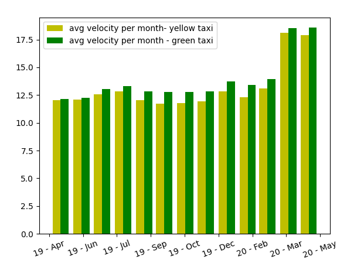

# ASEREHE PROJECT

## Dokonaj analizy danych zawierających informacje na temat poruszających się taksówek w Nowym Jorku (yellow and green taxi). Zbiór danych zawiera następujące informacje (pick-up and drop-off dates/times, pick-up and drop-off locations, trip distances, itemized fares, rate types, payment types, and driver-reported passenger counts). 

Zadanie wymaga przeanalizowania danych w następującym przedziale czasowym:
Rok 2020 / Maj
Rok 2019 / Maj


- [ ] Wykryj anomalie pomiędzy (pick-up and drop-off dates/times) a przebytym dystansem. Z wykorzystaniem metody grupowania według k-średnich znajdź i zinterpretuj wyniki.
- [ ] Skoreluj informacje dotyczące typu płatności a ilości przewożonych pasażerów
- [x] Wylicz średnią prędkość taksówki na podstawie informacji na temat czasu (pick-up and drop-off dates/times) oraz przebytej odległości (trip distances)

Zbiór danych:
https://www1.nyc.gov/site/tlc/about/tlc-trip-record-data.page 
https://registry.opendata.aws

Wymagania:
Technologie: EMR/Spark/Python/Scala/Java
Rezultaty proszę zaprezentować w formie graficznej z wykorzystaniem odpowiedniej biblioteki 
Kod źródłowy projektu należy umieścić w środowisku github
Sprawozdanie projektu należy zapisać w pliku README.md
UWAGA: proszę wybrać jeden z podpunktów a), b) lub c) 


### Installation for Linux (for local testing)
```bash
python3 -m venv env
pip install -r requirements.txt

sudo chmod +x get_data.sh
./get_data.sh
```
### Used stack
  - S3 for dataset purposes
  - EC2 running linux
  - Amazon EMR with ApacheSpark 
  - Python3 with PySpark

### Cluster configuration
  - Release label: emr-5.32.0

  - Hadoop distribution: Amazon 2.10.1

  - Aplications: Hive 2.3.7, Pig 0.17.0, Hue 4.8.0, JupyterEnterpriseGateway 2.1.0, Livy 0.7.0, Spark 2.4.7

### Research results
<p>Average car speeds monthly and daily.</p>




